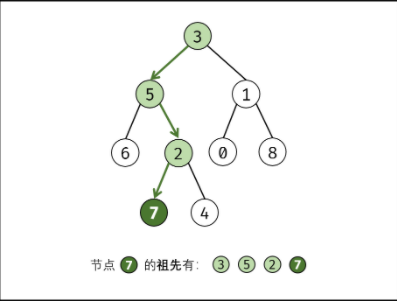

## 236 - Lowest Common Ancestor of a Binary Tree Solution Analysis
* Ancestor definition: If node `p` is in `root`'s left or right children, or `p == root`,
then `root` is node `p`'s ancestor. You can see from the following picture:

