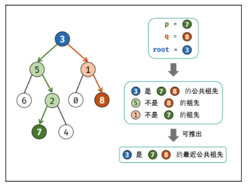

## 236 - Lowest Common Ancestor of a Binary Tree Solution Analysis

### Definitions
* Ancestor definition: If node `p` is in `root`'s left or right children, or `p == root`,
then `root` is node `p`'s ancestor. You can see from the following picture:

* Lowest common ancestor definition: node `root` is the common ancestor of node `p`
and node `q`, if `root.left` and `root.right` are not `p` and `q`'s common ancestor, 
the `root` is the lower common ancestor.

Based on the above definition, if `root` is `p` and `q`'s lowest common ancestor:
1. `p` and `q` are in `root` children, and on different sides
2. If `p == root`, and `q` is in `root`'s left or right sub tree
3. If `q == root`, and `p` is in `root`'s left or right sub tree

We can traverse binary tree in postorder, return on node `p` or `q`, then when
node `p` or `q` on different sides of `root`, return `root`.

### Recursion analysis
1. Recursion terminator:
  * If reaches leaf node, return None
  * If `root` is `p` or `q`, return `root`
2. Drill down to next level, since we are doing post order, we drill down first.
  * Recursion on left child: `left = recursion(root.left)`
  * Recursion on right child: `right = recursion(root.right)`
3. Process logic in current level:
  * If `left` and `right` are both `None`, return `None`. (Neither `p` or `q` is
  in `root` children)
  * If `left` and `right` are not `None`, means `p` and `q` are in differnet 
  subtree of `root`, return `root`
  * `left` is `None` and `right` is not `None`, return `right`
  * `right` is `None` and `left` is not `None`, return `left`

### Complexity
* Time complexity: O(N), N is the total number of nodes
* Space complexity: O(N), we need to load the entire tree (N nodes) into memory