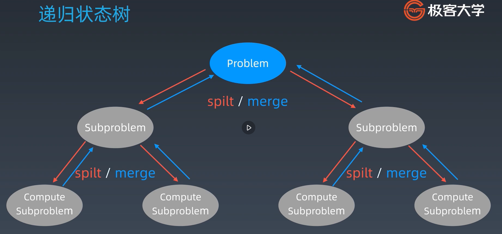

## 学习笔记

### 动态规划
* 动态规划本质： 将一个复杂的问题分解成各种子问题，同时寻找它的重复性。不管是分治，回溯，递归还是动态规划，它们在本质上并没有非常大的不一样。
* ***Simplifying a complicated problem by breaking it down into simpler subproblems (In a recursive manner)***
* 三句绝学：
  * 动态规划和递归或者分治没有根本上的区别 (关键看有无最优的子结构)
  * ***共性：找到重复子问题***
  * 差异性： 最优子结构，中途可以***淘汰***次优解 
* 动态规划问题的一般形势就是求最值，其实是运筹学的一种方法，只不过在计算机问题上应用比较多。比如
求最长递增子序列，最小编辑距离。
* 动态规划的核心问题是穷举，因为要求最值问题，那么肯定要把所有可行的答案穷举出来，然后在
其中找最值。

### 动态规划穷举技巧
* 动态规划的穷举有点特别，因为一般动态规划的问题都存在"重叠子问题"，如果暴力穷举的话效率会及其的低下，所以
一般都会在穷举过程中加入"Memo"或者"dp table"来进行优化。
* 动态规划问题一定会具备"最优子结构"，才能通过子问题最值得到愿问题的最值。
* 必须要列出正确的"状态专业方程"才能正确穷举。
* 综上所述，我们可以得出动态规划的三要素
  * 重叠子问题
  * 最优子结构
  * 状态转移方程 （最困难）
  
### 动态规划思维框架
* 明确 base case
* 明确 "状态"
* 明确 "选择"
* 定义dp函数
```python
# Initialize base case
dp[0][0][...] = base
# Status transfer
for status1 in all_status1_values:
    for status2 in all_status2_values:
        for ...:
            dp[status1][status2][...] = Max(choice1, choice2, ...)
```

### 复习
* 递归代码模版

```python
def recur(int level, int param):
	# Terminator
	if level > MAX_LEVEL:
		return
	
	# Process current logic
	process(level, param)
	
	# Drill down
	recur(level + 1, new_param)
	
	# Restore current status
```
* 分治： 很多大的问题都有自相似性


```python
def divide_conquer(problem, param1, param2..):
	# Recursion terminator
	if problem is None:
		print_result
		return
	
	# Prepare data
	data = prepare_data(problem)
	sub_problems = split_problem(problem, data)
	
	# Conquer subproblems
	sub_result1 = self.divide_conquer(sub_problems[0], p1, ...)
	sub_result2 = self.divide_conquer(sub_problems[1], p1, ...)
	sub_result3 = self.divide_conquer(sub_problems[2], p1, ...)
	...
	
	# Process and generate the final result
	result = process_result(sub_result1, sub_result2, sub_result3, ...)
	
	# Rever the current level states
```

### 感触
1. 人肉递归低效， 很累
2. 找到最近最简的方法， 将其拆解成可重复解决的问题
3. 数学归纳法思维（抵制人肉递归的诱惑）

本质： 寻找重复性 -> 计算机指令集

### 小结
1. 打破自己的思维惯性，形成机器思维 (找重复性)
2. 理解复杂逻辑的关键
3. 也是职业进阶的要点要领