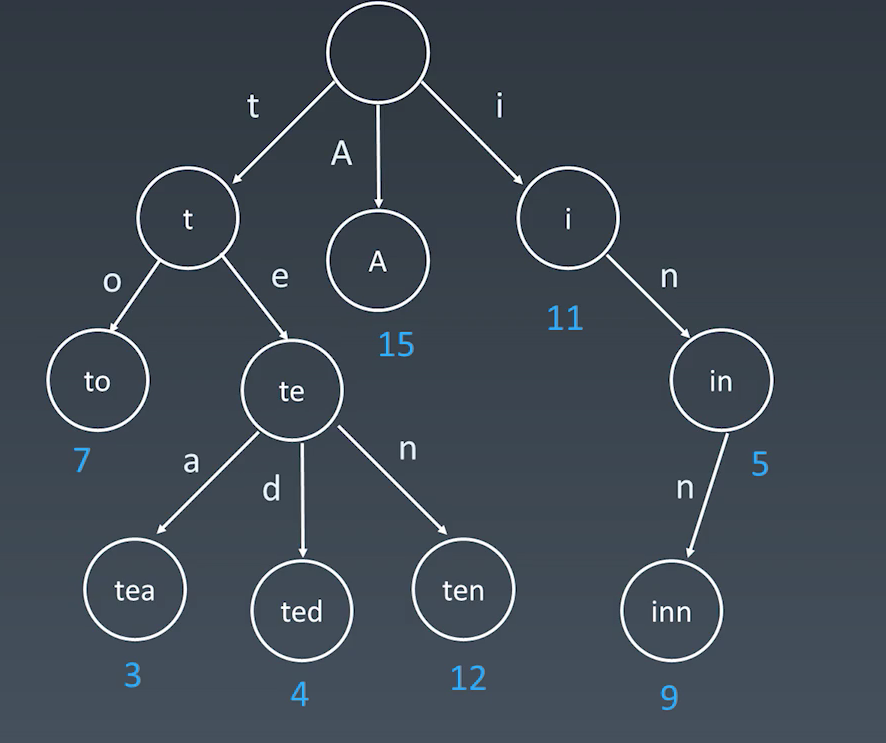
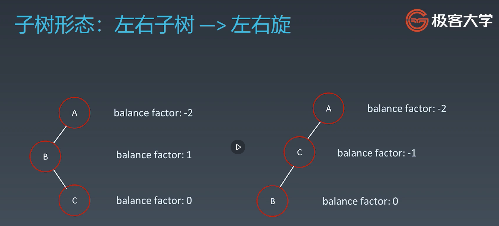

## 学习笔记

## Trie
* 数据结构： 字典树，即Trie树，又称单词查找树或者键树，是一种树形结构。典型应用是用于统计和排序大量
的字符串（但不仅限于字符串），所以经常被搜索引擎系统用于文本词频统计。

* 结构优点：最大限度的减少无谓的字符串比较，查询效率高于hash
* 核心思想
  * 空间换时间
  * 利用字符串的公共前缀来降低查询时间的开销以达到提高效率的目的
* 基本性质
  * 结点本身不存完整单词
  * 从根结点到某一节点，路径上经过的字符连接起来，为该节点对应的字符串
  * 每个节点的所有子节点路径代表的字符都不相同

### Trie的结点内部实现


## 并查集
* 适用场景 （在现实中你需要很快判断这两个个体是不是在一个集合中）
  * 组团
  * 配对问题
  * 比如微信上好友或者朋友圈，以及分析两个人是不是好友的问题
* 基本操作
  * makeSet(s): 建立一个新的并查集，其中包含s个单元素集合
  * unionSet(x,y): 把元素x和元素y所在的集合合并， 要求x和y所在的集合不相交，如果相交则不合并
  * find(x): 找到元素x所在的集合的代表，该操作也可以用于判断两个元素是否位于同一个集合，
  只要将他们各自的代表比较一下就可以了。

## 启发式搜索(heuristic)
* 在进行搜索的时候加入一些智能元素进去
* 估价函数: h(n), 它用来评价哪些结点最有希望的是一个我们要找的结点，h(n)会返回一个非负数， 也
可以认为是从结点n的目标结点路径的估计成本。启发式函数是一种告知搜索方向的方法。它提供了一种明智的
方法来猜测哪个邻居结点会导向一个目标。
* 模版
```python
def AstarSearch(graph, start, end):
    pq = collections.priority_queue()  # Priority -> Evaluate
    pq.append([start])
    visited.add(start)

    while pq:
        node = pq.pop()
        visited.add(node)

        process(node)
        nodes = generated_related_nodes(node)
        unvisited = [node for node in nodes if node not in visited]
        pq.push(unvisited)
```

## 平衡二叉树
* 平衡二叉树有很多种，具体可以看这个link: https://en.wikipedia.org/wiki/Self-balancing_binary_search_tree
* 大致要了解的平衡二叉树有:
  * 2-3 tree
  * AVL tree
  * B-Tree
  * Red-black tree
  * Splay tree
* 如何保证一棵树的平衡？在每一步插入的时候就去判断它是否平衡，以及将它维护成平衡二叉树的状态
### AVL Tree
* 发明者 G.M.Adelson-Velsky和Evgenii Landis
* 引入了以下两个概念
  * Balance Factor (平衡因子): 左子树的高度减去右子树的高度 (有时相反), balance factor = {-1, 0 1}
  * 通过旋转操作来进行平衡 (四种)
* 左右子树高度

* 不足之处是需要存储额外的信息，并且调整次数频繁
* 四种旋转操作
  * 左旋
  
  * 右旋
  
  * 左右旋
  
  
  * 右左旋 (类似左右旋)
  
 

### 红黑树 (近似平衡二叉树) Red-black Tree
* 红黑树是一种近似平衡二叉树，它能够确保任何一个结点的左右子树的高度差小于两倍。具体来说，红黑树是满足
如下条件的二叉搜索树
  * 每个结点要么是红色, 要么是黑色
  * 根结点是黑色
  * 每个叶结点 (NIL结点, 空结点) 是黑色的
  * 不能有相邻接的两个红色结点
  * 从任一结点到其每个叶子结点的所有路径都包含相同数目的黑色结点。
* 从根到叶子的最长的可能路径不多余最短的可能路径的两倍长。


### AVL vs Red-black Tree

  