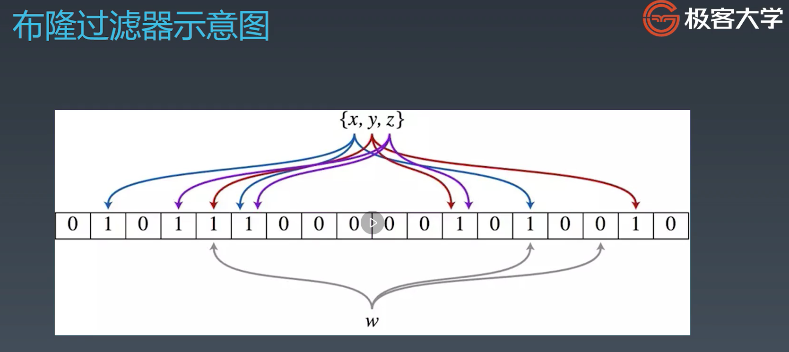
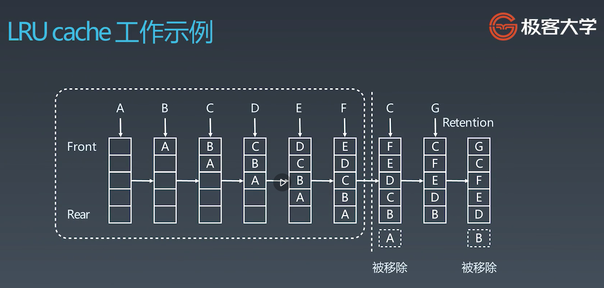
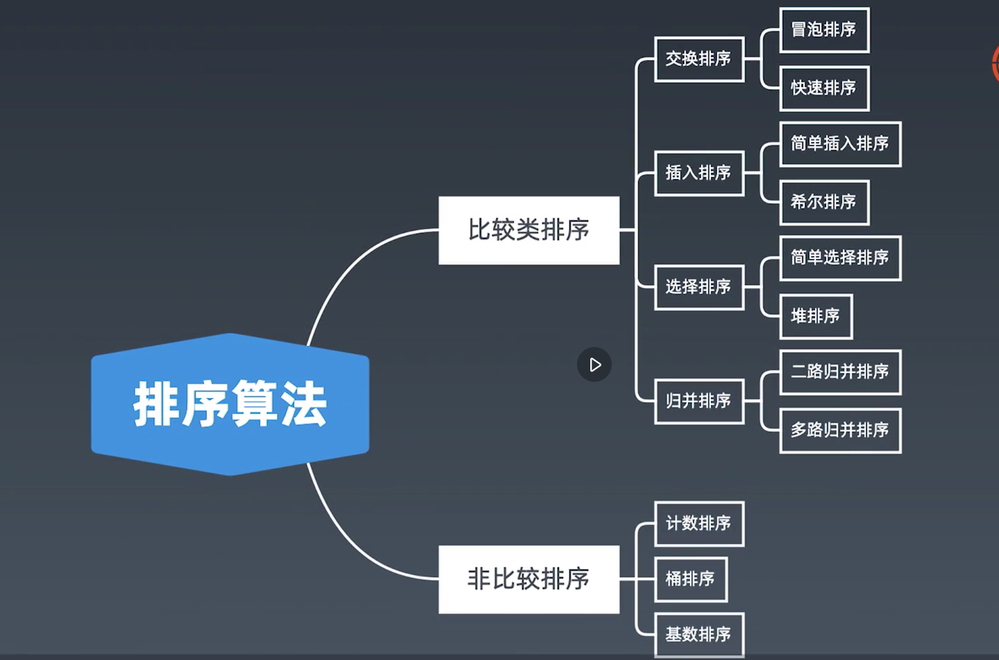
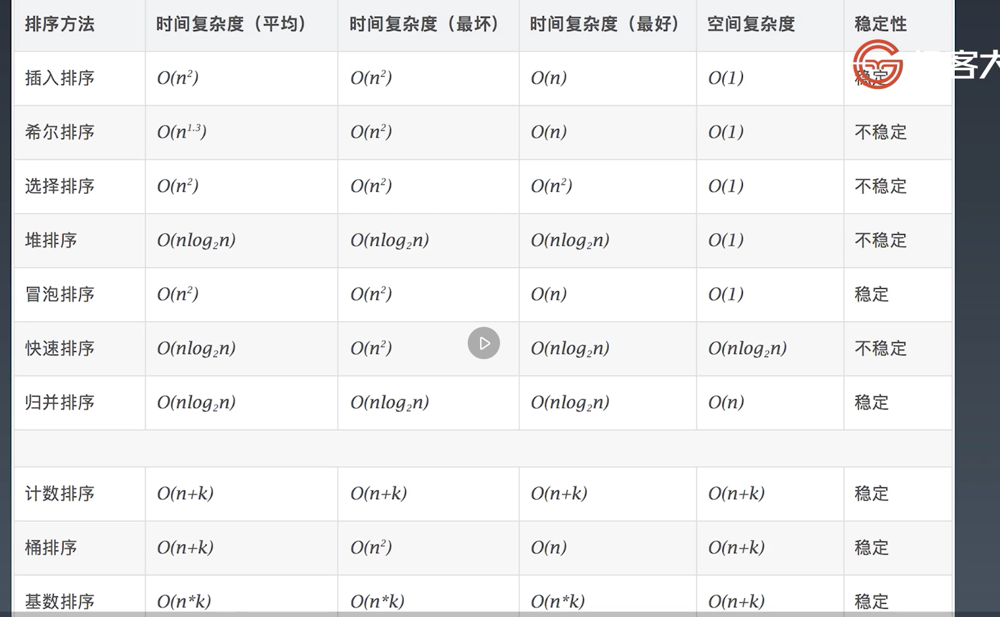

## 学习笔记
### 位运算符
* 为什需要位运算？因为机器里的数字表示方式和存储格式就是二进制
  * 如何把十进制转化为二进制？余数短除法
  * 如何把二进制转化为十进制？乘二相加法
* 位运算符
  * 左移: << (0011 => 0110)
  * 右移: >> (0110 => 0011)
  * 或运算: | (0011 | 1011 => 1011)
  * 与运算: & (0011 & 1011 => 0011)
  * 取反: ~ (~0011 = 1100)
  * 异或: ^ (0011 ^ 1011 => 1000)
* 进阶异或操作
  * X ^ 0 = X
  * X ^ 1S = ~X
  * X ^ (~X) = 1S
  * X ^ X = 0
  * C = A ^ B => A ^ C = B, B ^ C = A // 交换两个数 
  * A ^ B ^ C = A ^ (B ^ C) = (A ^ B) ^ C // Associative
### 位运算的应用
* 程序里面经常用到的位运算
  * 将最右边的n位清零: X & (~0 << N)
  * 获取X的第N位值 (0或者1): (X >> N) & 1
  * 获取X的第N位的幂值: X & (1 << N)
  * 仅将第N位置为1: X | (1 << N)
  * 仅将第N位置为0: X & (~(1 << N))
  * 将X最高位至第N位（含）清零: X & ((1 << N) - 1)
* 必须要记住，最经典常用的
  * 判断奇偶:
    * X % 2 == 1 -> X & 1 == 1
    * X % 2 == 0 -> X & 1 == 0
  * X >> 1 -> X // 2
    * X = X // 2 -> X = X >> 1
    * mid = (left + right)/2 -> mid = (left + right) >> 1
  * 清零最低位的1 
    * X = X & (X - 1)
```bash
x = 01101000
x - 1 = 01100111
x & (x - 1) = 01101000 & 01100111 = 01100000
```
  * 得到最低位的1: 一个正数的补码为原码自己，设为a，其负数形式的补码设为b，
  可知a+b=0。方法一的求解方式就是先把这个数二进制中为0的哪些位给加上来，
  再加1，使得其进位，溢出为0. 如 `6=0000 0110`，
  `-6 = 1111 1001 + 1 = 1111 1010`, 可见最低位的1右边的0，
  在取反之后就会全部变为1，再加一，进位后，取反获取的1全部进位了，
  最低位的1又被进位上来了，即最低位的1保持不变。
    * X & -X
```bash
x =  0000 0110
-x = 1111 1001 + 1 = 1111 1010
x & -x = 0000 0110 & 1111 1010 = 0b10
```
  * X & ~X => 0
```bash
x =  0110
~x = 1001
x % ~x - 0110 & 1001 = 0
```

### 布隆过滤器 Bloom Filter
* 定义: 布隆过滤器是一个很长的二进制向量和一系列随机映射函数。布隆过滤器可以用于检索
一个元素是否在一个集合中。它跟哈希表最大的区别就是，哈希表不仅可以判断它是否在集合中，而且
还可以存很多的其它的信息。而布隆过滤器只能存一个在或者不在的信息。
* 优点: 空间效率和查询时间都远远超过一般的算法
* 缺点: 有一定的误识别率和删除困难

* 如果一个元素它的二进制位只要有一个为0，就说明这个元素不在布隆过滤器的索引里面，并且我们是
可以肯定它是不在的。
* 结论: 当布隆过滤器把元素都插入完毕之后，对于测试元素，如果要验证它是否存在的话，当它验证这个
元素所对应的二进制位是1 的时候, 我们只能说它可能存在布隆过滤器里面。但是当这个元素对应的二进制
位只要有一个不为1的话，那么我们可以说它肯定不在布隆过滤器里面。
* 应用: 布隆过滤器一般只是放在外面来当一个缓存使用的，目的是做出快速的判断，是一种模糊查询。如果
元素可能存在，那么再做进一步的判断。
* 布隆过滤器的应用:
  * 比特币网络
  * 分布式系统 (Map-Reduce)
  * Redis缓存
  * 垃圾邮件，评论的过滤

### LRU (Least Recent Used) Cache
* 两个要素: 大小和替换策略
* 实现: 
  * Hash Table + Double LinkedList
* 时间复杂度:
  * O(1) 查询
  * O(1) 修改，更新
* 工作示例


### 排序
* 排序算法类别
  * 比较类排序: 通过比较来决定元素间的相对次序，由于其时间复杂度不能突破O(nlogn), 因此也称为
  非线性时间比较类排序
  * 非比较类排序: 不通过比较来决定元素间的相对次序，它可以突破基于比较排序的时间下界，以线性
  的时间运行，因此也称为线性时间非比较类排序。
* 排序分类

* 排序算法比较



### 特殊排序
* 计数排序 (Counting Sort)
  * 计数排序要求输入的数据必须是有确定范围的正数。将输入的数据值转化为键存储在
  额外开辟的数组空间中；然后依次把计数大于1的填充回原数组
* 桶排序 (Bucket Sort)
  * 工作原理: 假设输入数据服从均匀分布，将数据分到有限数量的桶里，每个桶再分别排序 (有可能
  再使用别的排序算法或是以递归的方式继续使用桶排序进行排)
* 基数排序 (Radix Sort)
  * 基数排序是按照低位先排序，然后收集; 再按照高位排序，然后再收集; 依次类推，直到最高位。
  有时候有些属性是有优先级顺序的，先按低优先级排序，再按高优先级排序。
  

